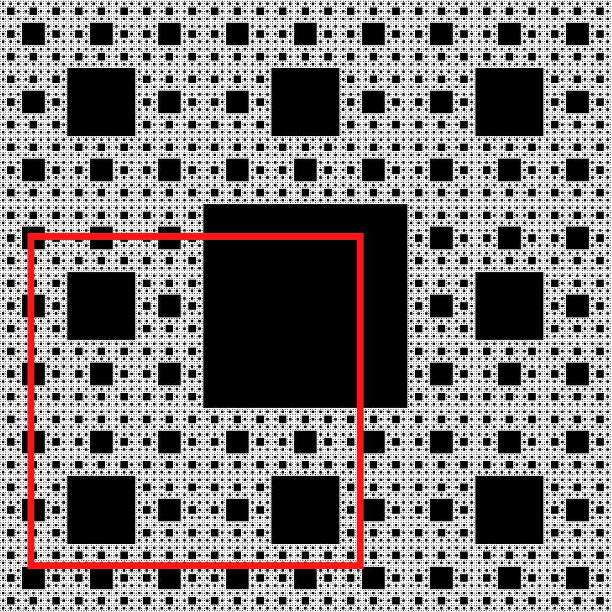
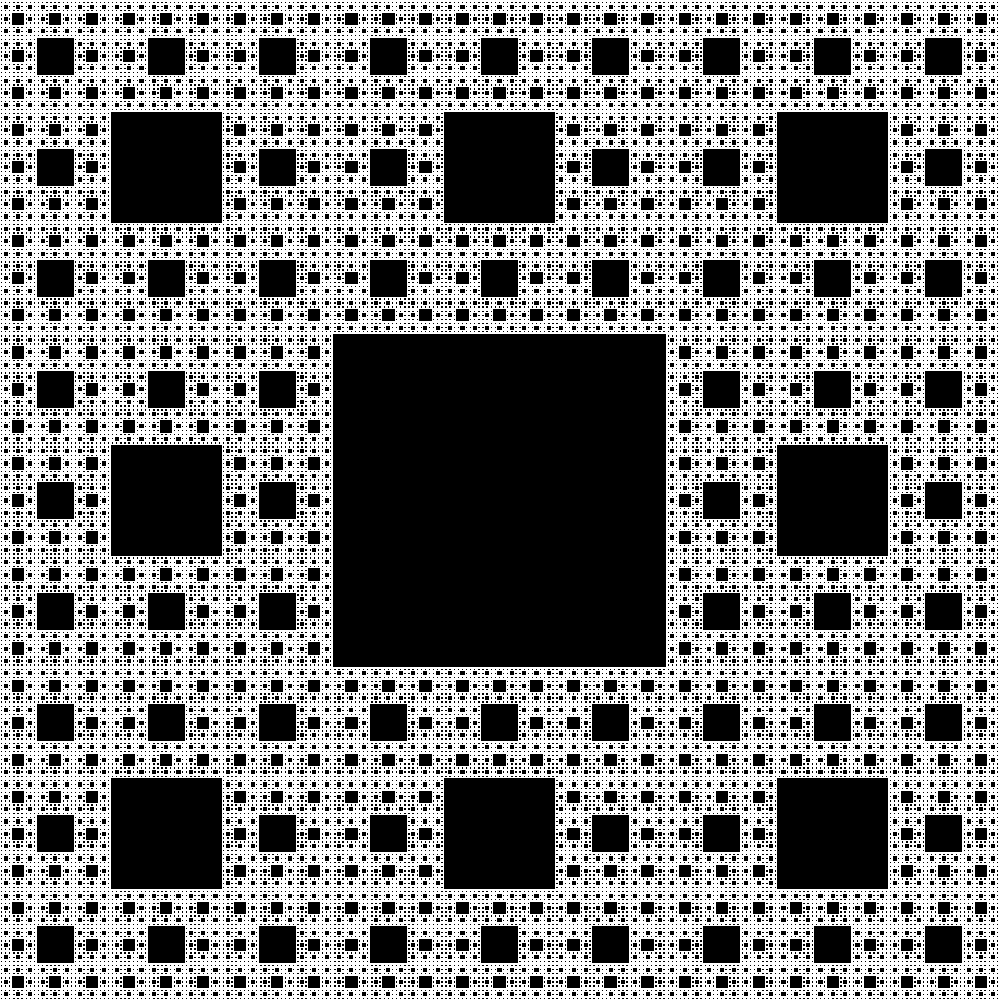
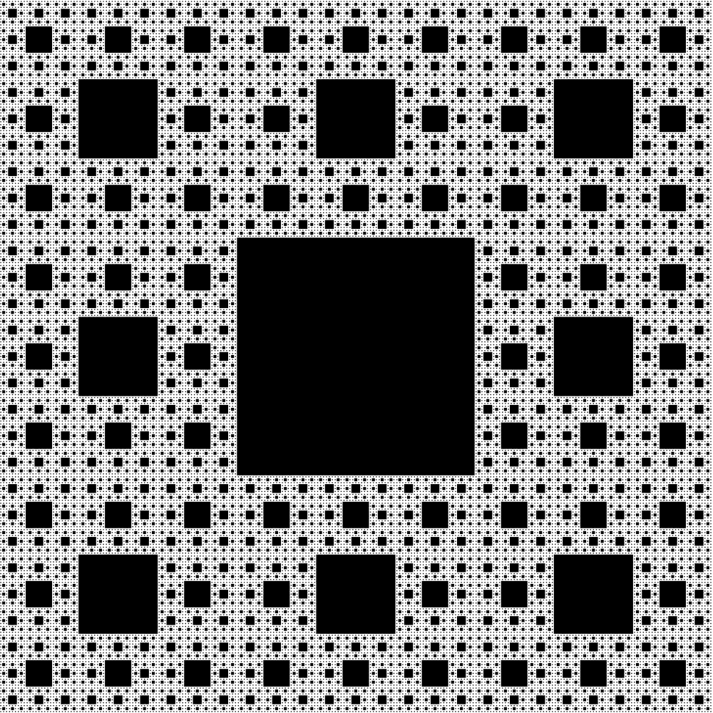
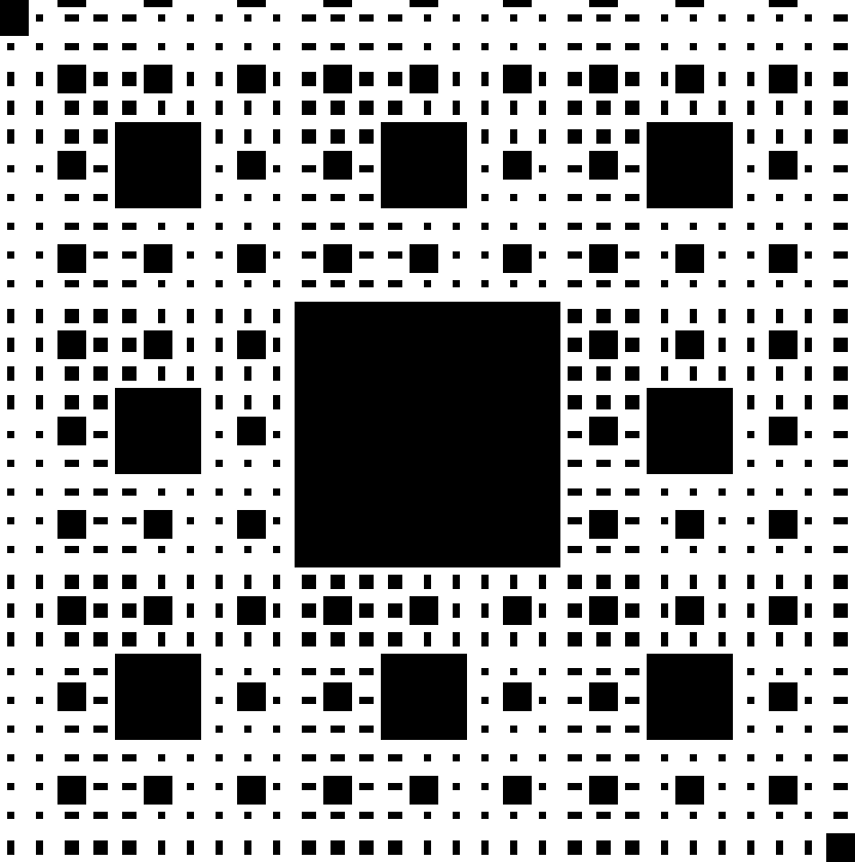

# JAVA Fractal Library

this library allow you to create fractal and render them in 2D.

the library consist in one class named Fractal.

## setup

to install the library download the git, and add the file **Fractal.jar** to the environment variable **Classpath**

## basic utilisation

the detail of the library is availible here on the [javadocs](https://physicdev.github.io/Fractal/)

in order to use it you need to create a static method to compute the maximum fractal depth in which a point is in the fractal. Usualy the easiest way to do that is by making a recursive function.

the fractal also need a dimension, this is use to ensure that the program will work as intented and prevent error.

```java
import fractal.Fractal;

public class Test{
    static int fractalInit(double[] coord,int maxDepth){
        //init method
        return fractal(coord,maxDepth, inital argument);
    }

    static int fractal(double[] coord,int maxDepth, more arguments){
        //something like this :
        /**
         * 1. Checking if not in fractal : return 0
         * 2. Checking if reach maxDepth : return 1
         * 3. recursive call 
         */
    }

    //we give the init method as argument of the fractal
    public Fractal someFractal(2,Test::fractalInit)
}
```

the maximum depth of the fractal is an attribute of the class that can be modified.

## rendering

the fractal class can compute an instance of the java class BufferedImage of the fractal, to do that you have to specify the size of the Image, the color of the fractal and the background and the maximum depth which indicate how deep in the fractal a point need to be to be consider in the fractal.

additionaly you can add information about the position of the camera, more precisely the origin of the camera (the origin is at the upper left corner of the image) and two vector indicating the direction along the X and Y axis corresponding the horizontal and vertical axis of the image. This system allow to render fractal with dimension higher than 2 by selecting a 2D section of a 3D or higher dimension space and redering the fractal in this plane.

there are two main way of rendering the image with the class Fractal.

the first method is the fastest, but is less precise as it compute only the point corresponding to the upper left point of every pixel. this can cause a pixel to be fully drawn or not drawn only because one of its point is or is not in the fractal.

in the next image the pixel indicated in red will be black as  the upper left corner of the pixel is in a dark area of the fractal even if the pixel content contain more white.


to solve this issue, i've created another drawing method that use a random sampling of points in the pixel to determine on much the pixel should be drawn.

here a comparaison of the render :




the difference is more clear if we zoom in the picture:




the size of the sampling of each pixel is an attribute that can be modified.

## future of the project.

i've created this library without any particuliar final objective, so if you want me to add some functionality about this project (or if you find bugs). you can talk to me on my discord server : https://discord.gg/xhWmyCpKbW.
